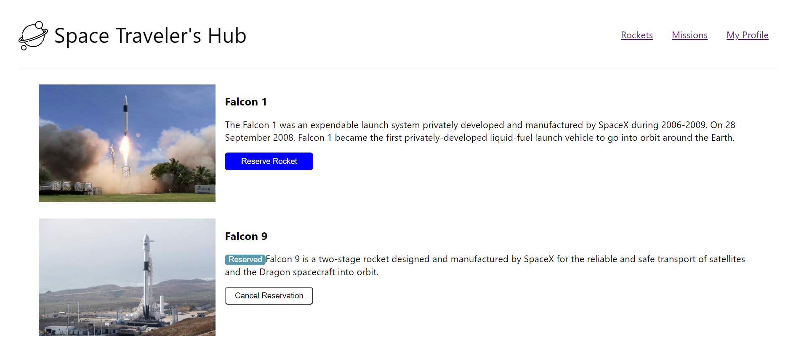
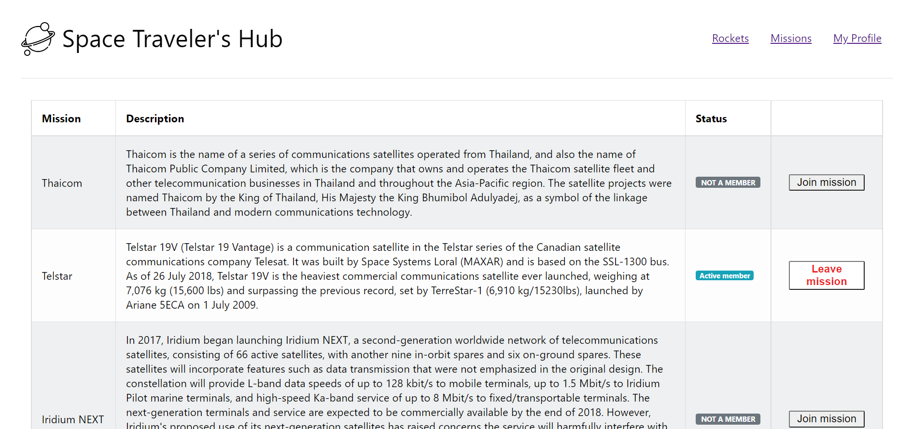
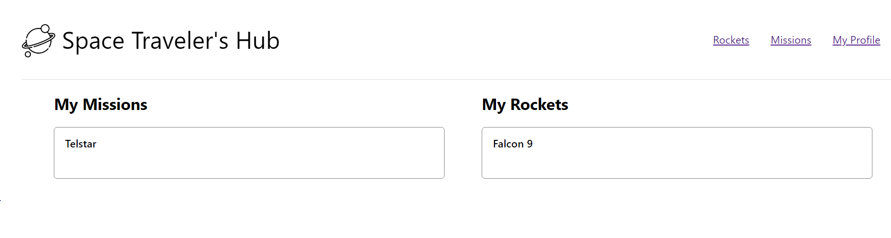

# Space Travellers' Hub

 Space Travellers' Hub is a web application for a company that provides commercial and scientific space travel services. The application will allow users to book rockets and join selected space missions.

## Live demo
https://kevin-elshamy.netlify.app/

# Screenshots
### Rockets Page

### Missions Page

### My Profile Page

## Built With

- React.js
- React router
- React Redux.
- React Logger.
- React Thunks

## Getting Started

### Setup

Have the latest version of Node installed. 
Next open terminal run `cd space_travellers_hub`

### Install

Run `npm install` to install dependencies on your computer.

### Usage

Run `npm start` to start the application

## Authors

👤 **Kevin Koome**

- GitHub: [@koomekevo](https://github.com/koomekevo)
- Twitter: [@koomekevo](https://twitter.com/koomekevo)
- LinkedIn: [LinkedIn](https://ke.linkedin.com/in/kevin-koome-aab84186)

👤 **Mohamed Elshamy**

- GitHub: [@mohamedelshamy](https://github.com/mohamedelshamy55) 
- Twitter: [@mohamedelshamy](https://mobile.twitter.com/moelshamy55) 
- LinkedIn: [LinkedIn](https://www.linkedin.com/in/mohamedelshamy85/) 

## 🤝 Contributing

Contributions, issues, and feature requests are welcome!

Feel free to check the [issues page](../../issues/).

## Show your support

Give a ⭐️ if you like this project!

## 📝 License

This project is [MIT](./MIT.md) licensed.